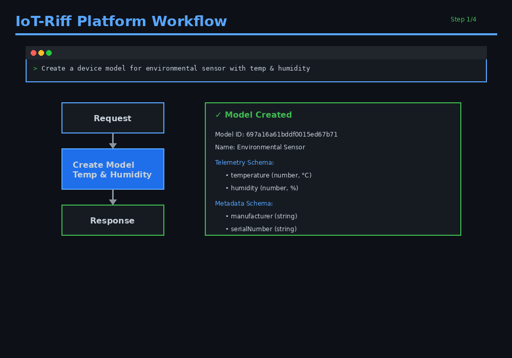
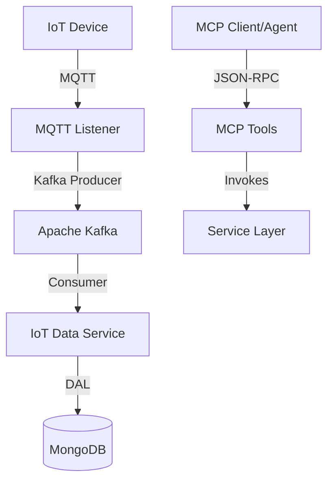

# IoT-Riff: MCP Server for IoT Management

IoT-Riff is a specialized **Model Context Protocol (MCP) Server** designed to provide AI agents with a comprehensive interface for managing and monitoring IoT ecosystems. Built with the [Micronaut Framework](https://micronaut.io/), it bridges the gap between agentic intelligence and physical device infrastructure.

## 🤖 Agentic IoT Interface

This platform is specifically engineered to be consumed by AI agents (like Claude Desktop ) via the Model Context Protocol. It allows agents to:
- **Understand** device capabilities through structured models and schemas.
- **Provision** and configure new devices autonomously.
- **Analyze** real-time and historical telemetry data.
- **Manage** complex IoT pipelines (MQTT to Kafka) through a simple tool-based interface.

## 🚀 Key Features

- **Device & Model Management**: Define reusable device models with flexible metadata and telemetry schemas.
- **Strict Validation**: Automated JSON Schema validation for all incoming telemetry and device metadata.
- **Scalable Ingestion**: High-throughput MQTT to Kafka ingestion pipeline.
- **Service Layer**: Fully implemented DAL (Data Access Layer) using MongoDB for persistent storage.
- **MCP Integration**: Native support for the Model Context Protocol, allowing AI agents to interact with the platform.
- **MQTT Listener**: Built-in high-performance MQTT broker integration using Netty.


## 🏗️ Architecture





## 🛠️ Tech Stack

- **Framework**: Micronaut 4.x (Java 21)
- **Ingestion**: Apache Kafka
- **Persistence**: MongoDB
- **Protocol**: MQTT 3.1.1 (Netty-based)
- **Validation**: NetworkNT JSON Schema Validator
- **Integration**: Model Context Protocol (MCP)

## 🚦 Getting Started

### Prerequisites

- **Java 21** or higher
- **Maven 3.9+**
- **MongoDB** (Running on `localhost:27017` by default)
- **Apache Kafka** (Running on `localhost:9092` by default)
- **MQTT Broker** (Optional, if using external)

### Build & Run

1. **Clone the repository**:
   ```bash
   git clone <repository-url>
   cd iot-riff
   ```

2. **Build the project**:
   ```bash
   ./mvnw clean install
   ```

3. **Run the application**:
   ```bash
   java -jar target/iot-riff-0.1.jar
   ```

## 🤖 MCP Tools

IoT-Riff exposes several tools for AI agents via MCP:

| Tool | Description |
|---|---|
| `createModel` | Define a new device model with schemas. |
| `createDevice` | Register a new device. |
| `listDevices` | List registered devices with filters. |
| `searchData` | Query historical telemetry data. |
| `deleteDevice` | Remove a device from the system. |

## 🔌 MCP Connection Configuration

To use IoT-Riff with MCP-compatible clients (like Claude Desktop), add the following to your configuration file (e.g., `~/Library/Application Support/Claude/claude_desktop_config.json` on macOS):

```json
{
  "mcpServers": {
    "iot-riff": {
      "command": "npx",
      "args": [
        "mcp-remote",
        "http://localhost:8080/mcp"
      ]
    }
  }
}
```


---

> 🚀 **IoT-Riff** was brought to life by **Siddharth**, fueled by the intelligent companionship and coding prowess of **Google Antigravity**. 🌌
