# IoT-Riff: MCP Server for IoT Management

IoT-Riff is a specialized **Model Context Protocol (MCP) Server** designed to provide AI agents with a comprehensive interface for managing and monitoring IoT ecosystems. Built with the [Micronaut Framework](https://micronaut.io/), it bridges the gap between agentic intelligence and physical device infrastructure.

## 🤖 Agentic IoT Interface

This platform is specifically engineered to be consumed by AI agents (like Claude Desktop ) via the Model Context Protocol. It allows agents to:
- **Understand** device capabilities through structured models and schemas.
- **Provision** and configure new devices autonomously.
- **Analyze** real-time and historical telemetry data.
- **Manage** complex IoT pipelines (MQTT to Kafka) through a simple tool-based interface.

## 🚀 Key Features

- **Device & Model Management**: Define reusable device models with flexible metadata and telemetry schemas.
- **Strict Validation**: Automated JSON Schema validation for all incoming telemetry and device metadata.
- **Scalable Ingestion**: High-throughput MQTT to Kafka ingestion pipeline.
- **Service Layer**: Fully implemented DAL (Data Access Layer) using MongoDB for persistent storage.
- **MCP Integration**: Native support for the Model Context Protocol, allowing AI agents to interact with the platform.
- **MQTT Listener**: Built-in high-performance MQTT broker integration using Netty.
- **Secret Management**: Integrated with HashiCorp Vault for secure storage and dynamic generation of device credentials.


## 🏗️ Architecture

```mermaid
graph TB
    subgraph Edge ["🌐 Edge Layer"]
        Device["📱 IoT Device"]
    end

    subgraph Interface ["🤖 Agent Interface"]
        MCPClient["💻 MCP Client / Agent"]
        MCPTools["🛠️ MCP Tools"]
    end

    subgraph Ingestion ["🚀 Ingestion & Security"]
        Listener["🛰️ MQTT Listener"]
        Vault["🔐 HashiCorp Vault"]
    end

    subgraph Backend ["⚙️ Backend & Persistence"]
        Kafka["📉 Apache Kafka"]
        ServiceLayer["🏗️ Service Layer"]
        MongoDB["💾 MongoDB"]
    end

    %% Data Flow
    Device -- "MQTT" --> Listener
    Listener -- "Auth & Credentials" --> Vault
    Listener -- "Produce" --> Kafka
    Kafka -- "Consume" --> ServiceLayer
    ServiceLayer -- "Sync" --> MongoDB
    ServiceLayer -- "Secrets" --> Vault

    %% Control Flow
    MCPClient -- "JSON-RPC" --> MCPTools
    MCPTools -- "Invoke" --> ServiceLayer

    %% Styling
    style Edge fill:#f8fafc,stroke:#475569,stroke-width:2px,color:#1e293b
    style Interface fill:#f1f5f9,stroke:#475569,stroke-width:2px,color:#1e293b
    style Ingestion fill:#f0fdf4,stroke:#166534,stroke-width:2px,color:#14532d
    style Backend fill:#fffbeb,stroke:#92400e,stroke-width:2px,color:#78350f

    %% Subgraph Styling
    classDef default stroke:#334155,stroke-width:1px;
```




## 🛠️ Tech Stack

- **Framework**: Micronaut 4.x (Java 21)
- **Ingestion**: Apache Kafka
- **Persistence**: MongoDB
- **Security**: HashiCorp Vault
- **Protocol**: MQTT 3.1.1 (Netty-based)
- **Validation**: NetworkNT JSON Schema Validator
- **Integration**: Model Context Protocol (MCP)

## 🚦 Getting Started (macOS)

### Prerequisites
- **Java 21** or higher
- **Maven 3.9+**

### Quick Start
The project includes a `run.sh` script that automates the entire setup process, including downloading and starting Infrastructure tools (Vault, Kafka, MongoDB).

1. **Clone the repository**:
   ```bash
   git clone <repository-url>
   cd iot-riff
   ```

2. **Run the Application**:
   ```bash
   ./run.sh
   ```
   
   This script will:
   - **Setup Infrastructure**: Download and start Vault, Kafka (KRaft), and MongoDB if they aren't running.
   - **Configure Environment**: Auto-configure shell environment variables (Vault Token, Paths) in your `~/.zshrc`.
   - **Build & Run**: Build the project and start the generic IoT-Riff server.

   > **Note**: Press `Ctrl+C` to gracefully shut down the application and all background services.

### 🔐 Vault & Credentials

To manually retrieve credentials for a device (e.g., to connect an MQTT client):

1. **Open a new terminal**

2. **Login to Vault**:
   ```bash
   vault login $VAULT_TOKEN
   ```

2. **Fetch Device Secret**:
   Each device's MQTT password is stored securely in Vault.
   ```bash
   vault kv get secret/data/<device_id>
   ```

   **Output Example**:
   ```text
   ==== Data ====
   Key     Value
   ---     -----
   data    map[password:<mqtt_password>]
   ```
   
   Use the <mqtt_password> from the output to authenticate your MQTT client.

## 🤖 MCP Tools

IoT-Riff exposes several tools for AI agents via MCP:

| Tool | Description |
|---|---|
| `createModel` | Define a new device model with schemas. |
| `createDevice` | Register a new device. |
| `listDevices` | List registered devices with filters. |
| `searchData` | Query historical telemetry data. |
| `deleteDevice` | Remove a device from the system. |

## 🔌 MCP Connection Configuration

To use IoT-Riff with MCP-compatible clients (like Claude Desktop), add the following to your configuration file (e.g., `~/Library/Application Support/Claude/claude_desktop_config.json` on macOS):

```json
{
  "mcpServers": {
    "iot-riff": {
      "command": "npx",
      "args": [
        "mcp-remote",
        "http://localhost:8080/mcp"
      ]
    }
  }
}
```


## 📄 License

This project is licensed under the MIT License - see the [LICENSE](LICENSE) file for details.


---

> 🚀 **IoT-Riff** was brought to life by **Siddharth**, fueled by the intelligent companionship and coding prowess of **Google Antigravity**. 🌌
